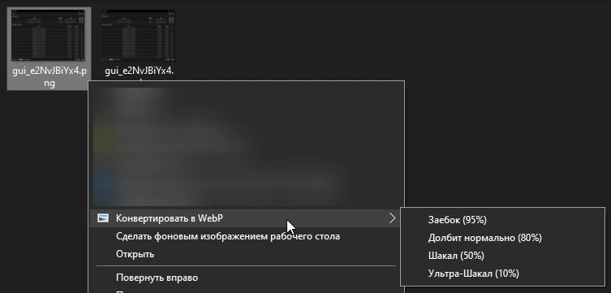
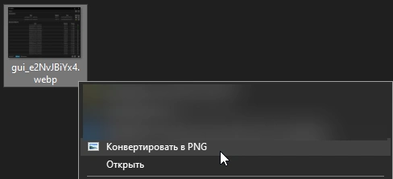

# Convert Context Menu

Добавляет пункты конвертации изображений в контекстное меню Windows 10.

## Возможности

- **PNG → WebP** — с выбором уровня качества:
  - Заебок (95%)
  - Долбит нормально (80%)
  - Шакал (50%)
  - Ультра-Шакал (10%)
- **WebP → PNG** — lossless конвертация

## Демонстрация

### PNG → WebP



### WebP → PNG



## Требования

- Windows 10
- [ffmpeg](https://ffmpeg.org/) в PATH

## Установка

```
install.bat
```

## Удаление

```
uninstall.bat
```
